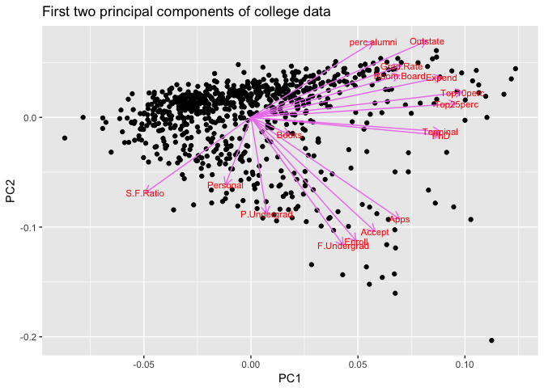
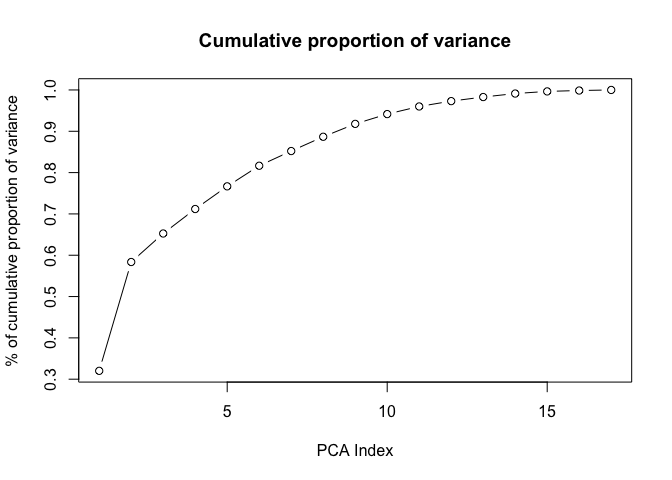
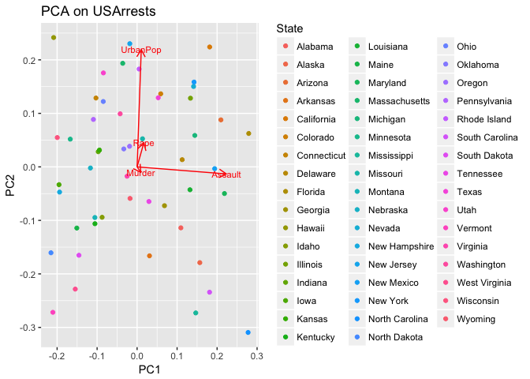
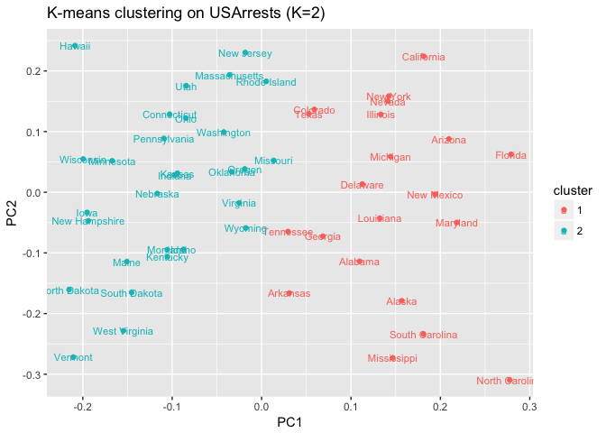
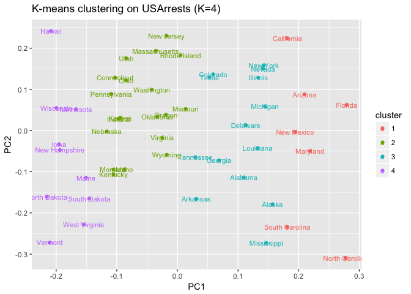
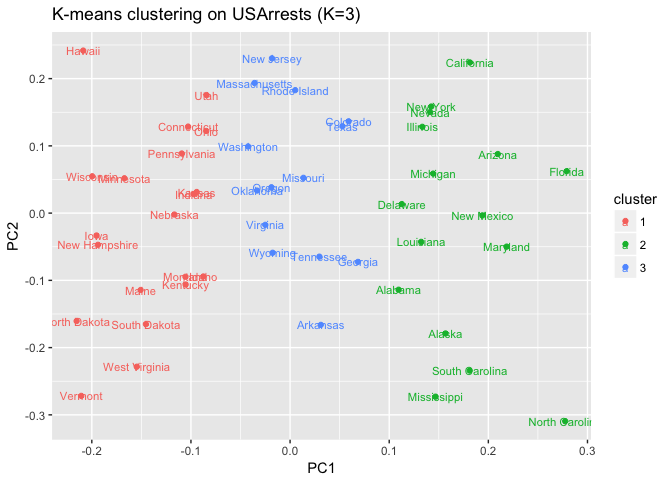
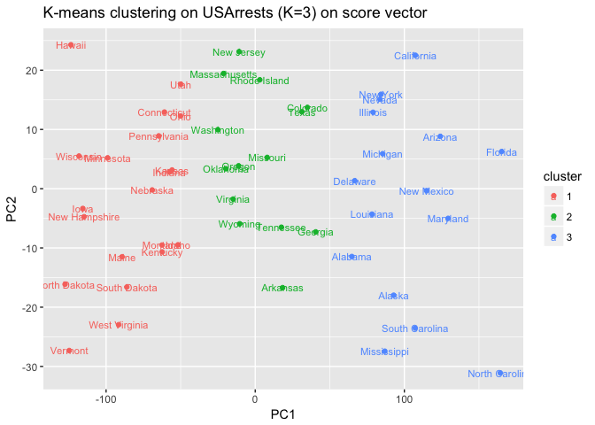
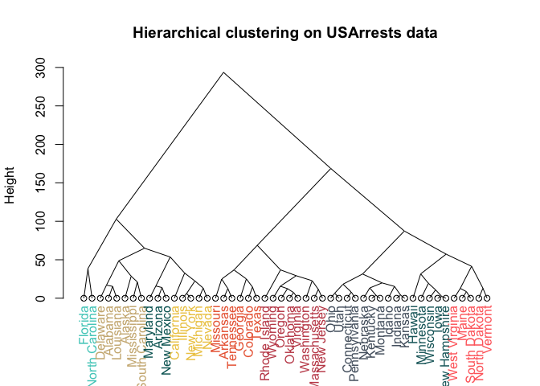
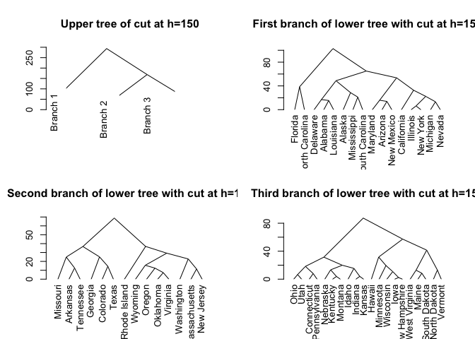
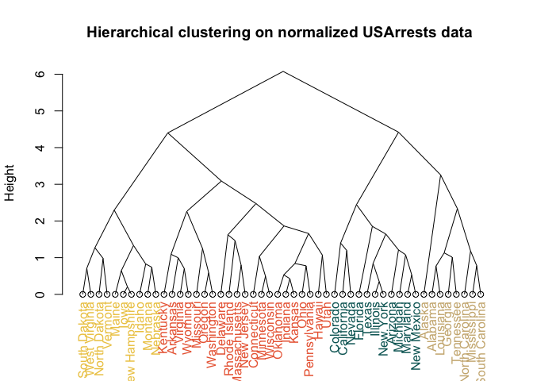

yu\_liqiang\_hw8\_Unsupervised\_learning
================
Liqiang Yu
11/29/2017

Colleges
--------

### Problem 1

Perform PCA analysis on the college dataset and plot the first two principal components. Describe the results.
(1) What variables appear strongly correlated on the first principal component?
We can easily see from the graph that perc.alumni, Outstate, Grad.Rate, Room.Board, Expend, Top10perc, Top25 perc, PhD and Terminal are highly correlated on the first principal component.
(2) What about the second principal component?
Variable highly correlated are, according to PC2: P.Undergrad, F.Undergrad, Enroll, Accept and Apps.

``` r
library(dplyr)
```

    ## 
    ## Attaching package: 'dplyr'

    ## The following objects are masked from 'package:stats':
    ## 
    ##     filter, lag

    ## The following objects are masked from 'package:base':
    ## 
    ##     intersect, setdiff, setequal, union

``` r
library(ggfortify)
```

    ## Loading required package: ggplot2

``` r
college = read.csv("/Users/Rex/Desktop/yu_liqiang_hw8/College.csv")
head(college)
```

    ##   Private Apps Accept Enroll Top10perc Top25perc F.Undergrad P.Undergrad
    ## 1     Yes 1660   1232    721        23        52        2885         537
    ## 2     Yes 2186   1924    512        16        29        2683        1227
    ## 3     Yes 1428   1097    336        22        50        1036          99
    ## 4     Yes  417    349    137        60        89         510          63
    ## 5     Yes  193    146     55        16        44         249         869
    ## 6     Yes  587    479    158        38        62         678          41
    ##   Outstate Room.Board Books Personal PhD Terminal S.F.Ratio perc.alumni
    ## 1     7440       3300   450     2200  70       78      18.1          12
    ## 2    12280       6450   750     1500  29       30      12.2          16
    ## 3    11250       3750   400     1165  53       66      12.9          30
    ## 4    12960       5450   450      875  92       97       7.7          37
    ## 5     7560       4120   800     1500  76       72      11.9           2
    ## 6    13500       3335   500      675  67       73       9.4          11
    ##   Expend Grad.Rate
    ## 1   7041        60
    ## 2  10527        56
    ## 3   8735        54
    ## 4  19016        59
    ## 5  10922        15
    ## 6   9727        55

``` r
college_tidy <- college 
#Remove non-numeric data
college_tidy$Private <- NULL
college.PCA <- prcomp(college_tidy,center = TRUE,scale. = TRUE)
autoplot(college.PCA, data = college, 
         loadings = TRUE, loadings.colour = 'violet',
         loadings.label = TRUE, loadings.label.size = 3)+labs(title="First two principal components of college data")
```



### Problem 2

Calculate the cumulative proportion of variance explained by all the principal components (see 10.2.3 in ISLR). Approximately how much of the variance in College is explained by the first two principal components?
From the PCA model, we conclude that the first two principal components comprise 58.36% variance of College data.

``` r
summary(college.PCA)
```

    ## Importance of components:
    ##                           PC1    PC2     PC3     PC4     PC5     PC6
    ## Standard deviation     2.3331 2.1161 1.08312 1.00345 0.96593 0.92054
    ## Proportion of Variance 0.3202 0.2634 0.06901 0.05923 0.05488 0.04985
    ## Cumulative Proportion  0.3202 0.5836 0.65262 0.71185 0.76673 0.81658
    ##                            PC7     PC8     PC9    PC10    PC11    PC12
    ## Standard deviation     0.77782 0.76623 0.72796 0.63544 0.55950 0.46939
    ## Proportion of Variance 0.03559 0.03454 0.03117 0.02375 0.01841 0.01296
    ## Cumulative Proportion  0.85217 0.88670 0.91788 0.94163 0.96004 0.97300
    ##                           PC13    PC14    PC15    PC16    PC17
    ## Standard deviation     0.40936 0.37920 0.29650 0.19152 0.15165
    ## Proportion of Variance 0.00986 0.00846 0.00517 0.00216 0.00135
    ## Cumulative Proportion  0.98286 0.99132 0.99649 0.99865 1.00000

``` r
vars <- apply(college.PCA$x, 2, var) 
props <- vars / sum(vars)
cumsum(props)
```

    ##       PC1       PC2       PC3       PC4       PC5       PC6       PC7 
    ## 0.3202063 0.5836084 0.6526176 0.7118475 0.7667315 0.8165785 0.8521673 
    ##       PC8       PC9      PC10      PC11      PC12      PC13      PC14 
    ## 0.8867035 0.9178758 0.9416277 0.9600420 0.9730024 0.9828599 0.9913184 
    ##      PC15      PC16      PC17 
    ## 0.9964896 0.9986472 1.0000000

``` r
plot(cumsum(props),main="Cumulative proportion of variance",xlab = "PCA Index", ylab = "% of cumulative proportion of variance",type="b")
```



Clustering states
=================

### Problem 1

Perform PCA on the dataset and plot the observations on the first and second principal components.

``` r
crime = read.csv("/Users/Rex/Desktop/yu_liqiang_hw8/USArrests.csv")
head(crime)
```

    ##        State Murder Assault UrbanPop Rape
    ## 1    Alabama   13.2     236       58 21.2
    ## 2     Alaska   10.0     263       48 44.5
    ## 3    Arizona    8.1     294       80 31.0
    ## 4   Arkansas    8.8     190       50 19.5
    ## 5 California    9.0     276       91 40.6
    ## 6   Colorado    7.9     204       78 38.7

``` r
crime_tidy <-crime
crime_tidy$State <- NULL
autoplot(prcomp(crime_tidy), data = crime, colour = 'State',label.size = 3,loadings = TRUE,loadings.label = TRUE,loadings.label.size = 3)+labs(title="PCA on USArrests")
```



### Problem 2

Perform *K*-means clustering with *K* = 2. Plot the observations on the first and second principal components and color-code each state based on their cluster membership. Describe your results.
With K-means clustering (K=2), we clusters data for 50 states into 2 clusters. Each cluster contains approximately the same number of observations. Cluster 1, labeled by blue points, represents the cluster of states with low crime rate while Cluster 2 (organe points) represents states with high crime rate.

``` r
autoplot(kmeans(crime_tidy, 2), data = USArrests, label = TRUE, label.size = 3)+labs(title="K-means clustering on USArrests (K=2)")
```



### Problem 3

Perform *K*-means clustering with *K* = 4. Plot the observations on the first and second principal components and color-code each state based on their cluster membership. Describe your results.
With K-means clustering (K=4), we clusters data for 50 states into 4 clusters. Each cluster contains a different number of observations. From the left to the right, Cluster 1, labeled by blue points, contains about 9 observations and represents the cluster of states with the lowest crime rate among all 4 clusters. Cluster 2, labeled by green points, contains about 17 observations and represents the cluster of states with low-to-medium crime rate among all 4 clusters. Cluster 3, labeled by organe points, contains about 9 observations and represents the cluster of states with medium-to-high crime rate among all 4 clusters. Cluster 4, labeled by organe points, contains about 14 observations and represents the cluster of states with the highest crime rate among all 4 clusters.

``` r
autoplot(kmeans(crime_tidy, 4), data = USArrests, label = TRUE, label.size = 3)+labs(title="K-means clustering on USArrests (K=4)")
```



### Problem 4

Perform *K*-means clustering with *K* = 3. Plot the observations on the first and second principal components and color-code each state based on their cluster membership. Describe your results.
With K-means clustering (K=3), we clusters data for 50 states into 3 clusters. Each cluster contains a different number of observations. Cluster 1, labeled by blue points, contains about 21 observations and indicates the cluster of states with the lowest crime rate among all 3 clusters. Cluster 2, labeled by orange points, contains about 14 observations and represents the cluster of states with medium crime rate in United States. Cluster 3, labeled by organe points, contains about 16 observations and represents the cluster of states with the highest crime rate among all states in US.

``` r
autoplot(kmeans(crime_tidy, 3), data = USArrests, label = TRUE, label.size = 3)+labs(title="K-means clustering on USArrests (K=3)")
```



### Problem 5

Perform *K*-means clustering with *K* = 3 on the first two principal components score vectors, rather than the raw data. Describe your results and compare them to the clustering results with *K* = 3 based on the raw data.
Using the score vectors instead of raw data, we get the same clustering result as in Problem 4, except the scale on x-y axis, which is reasonable since the score vector is linear dependent with principal components.
Ref:[What are principal component scores?](https://stats.stackexchange.com/questions/222/what-are-principal-component-scores)

``` r
crime_pca <- prcomp(crime_tidy)
scores<-crime_pca$x #Score vectors stored in crime_pca$x
centers=as.data.frame(kmeans(crime_tidy, 3)$centers)
autoplot(kmeans(crime_tidy, 3), data = USArrests, label = TRUE, label.size = 3,scale = FALSE)+labs(title="K-means clustering on USArrests (K=3) on score vector")
```



### Problem 6

Using hierarchical clustering with complete linkage and Euclidean distance, cluster the states.
See graph below.

``` r
crime_hc<-hclust(dist(USArrests,method = "euclidean"),method="complete")
labelColors = c("#CDB380", "#036564", "#EB6841", "#EDC951","#556270", "#4ECDC4","#1B676B", "#FF6B6B", "#C44D58")
clusMember = cutree(crime_hc, 9)
# function to get color labels
colLab <- function(n) {
    if (is.leaf(n)) {
        a <- attributes(n)
        labCol <- labelColors[clusMember[which(names(clusMember) == a$label)]]
        attr(n, "nodePar") <- c(a$nodePar, lab.col = labCol)
    }
    n
}
# using dendrapply
crime_hc_dend <- as.dendrogram(crime_hc)
clusDendro = dendrapply(crime_hc_dend, colLab)
plot(clusDendro, main = "Hierarchical clustering on USArrests data", ylab="Height", type = "triangle")
```



### Problem 7

Cut the dendrogram at a height that results in three distinct clusters. Which states belong to which clusters?
Cutting the dendrogram into three distinct clusters we get results below. It is clear to see which states belongs to which cluster below.

``` r
op = par(mfrow = c(2, 2))
crime_dend=as.dendrogram(crime_hc)
plot(cut(crime_dend, h = 150)$upper, main = "Upper tree of cut at h=150",type = "triangle")
plot(cut(crime_dend, h = 150)$lower[[1]], main = "First branch of lower tree with cut at h=150",type = "triangle")
plot(cut(crime_dend, h = 150)$lower[[2]], main = "Second branch of lower tree with cut at h=150",type = "triangle")
plot(cut(crime_dend, h = 150)$lower[[3]], main = "Third branch of lower tree with cut at h=150",type = "triangle")
```



### Problem 8

Hierarchically cluster the states using complete linkage and Euclidean distance, after scaling the variables to have standard deviation 1. What effect does scaling the variables have on the hierarchical clustering obtained?
After normalizing our data, we get a totally different result. The reason is that if we do not normalize our data, variables in our data set with a large valued units will be dominant the dissimilarity and other variables with a small valued units will contribute litte to the dissimilarity.

Ref:[Reason to normalize in euclidean distance measures in hierarchical clustering](https://stats.stackexchange.com/questions/30317/reason-to-normalize-in-euclidean-distance-measures-in-hierarchical-clustering)

``` r
crime_hc_scale<-hclust(dist(scale(USArrests),method = "euclidean"),method="complete")
labelColors = c("#CDB380", "#036564", "#EB6841", "#EDC951")
clusMember = cutree(crime_hc_scale, 4)
# function to get color labels
colLab <- function(n) {
    if (is.leaf(n)) {
        a <- attributes(n)
        labCol <- labelColors[clusMember[which(names(clusMember) == a$label)]]
        attr(n, "nodePar") <- c(a$nodePar, lab.col = labCol)
    }
    n
}
# using dendrapply
crime_hc_scale_dend <- as.dendrogram(crime_hc_scale)
clusDendro = dendrapply(crime_hc_scale_dend, colLab)
plot(clusDendro, main = "Hierarchical clustering on normalized USArrests data ", ylab="Height",type = "triangle")
```


