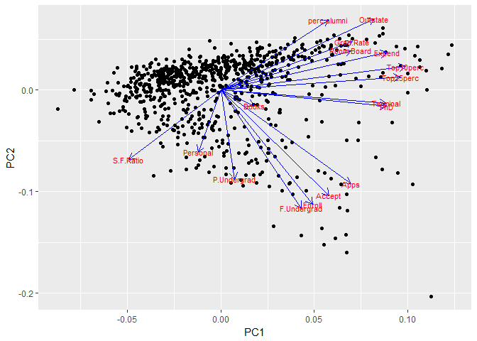
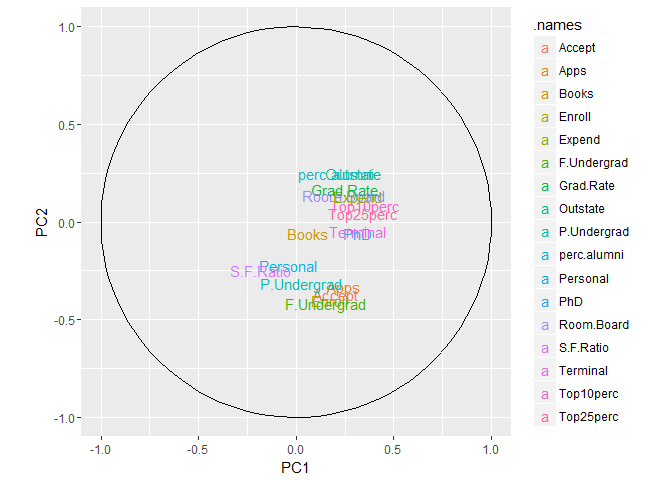
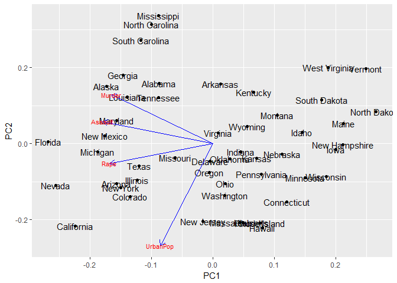
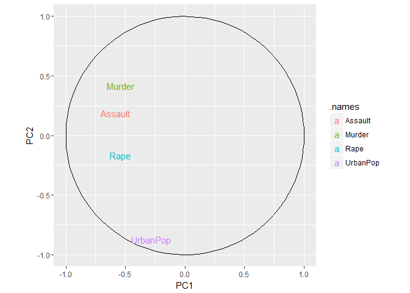
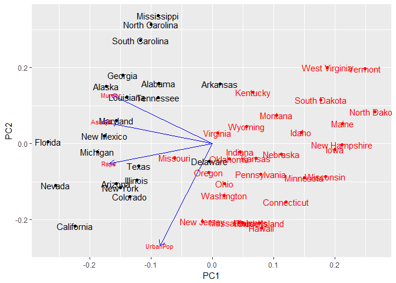
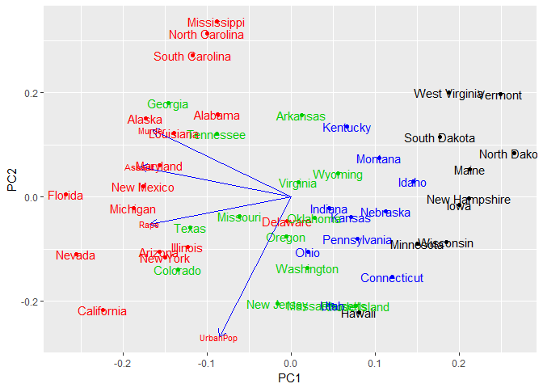
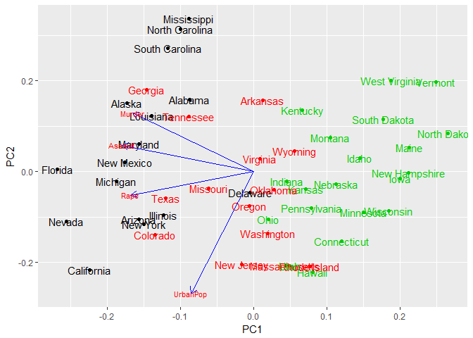
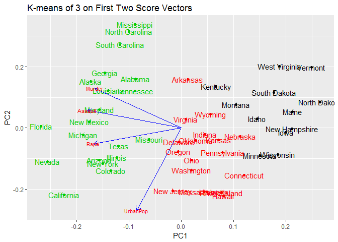
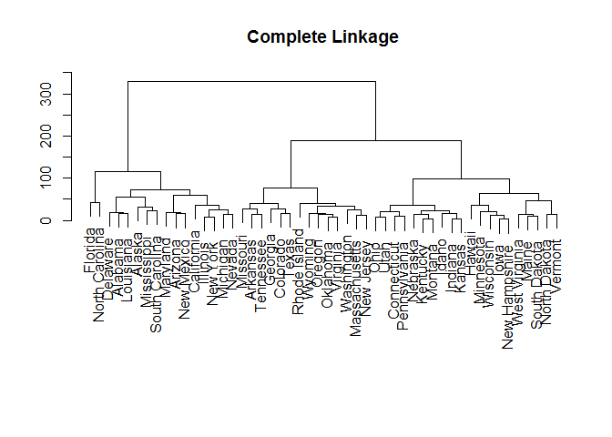

Unsupervized Learning Assignment
================
Weiwei Zheng
December 3, 2017

Load data
---------

``` r
rm(list=ls())
library(readr)
library(ggplot2)
```

    ## Warning: package 'ggplot2' was built under R version 3.4.3

``` r
library(ggfortify)
```

    ## Warning: namespace 'DBI' is not available and has been replaced
    ## by .GlobalEnv when processing object 'call.'

    ## Warning: namespace 'DBI' is not available and has been replaced
    ## by .GlobalEnv when processing object 'call.'

``` r
College <- read_csv("~/Desktop/persp-analysis/assignments/unsupervised-learning/data/College.csv")
```

    ## Parsed with column specification:
    ## cols(
    ##   Private = col_character(),
    ##   Apps = col_double(),
    ##   Accept = col_double(),
    ##   Enroll = col_double(),
    ##   Top10perc = col_double(),
    ##   Top25perc = col_double(),
    ##   F.Undergrad = col_double(),
    ##   P.Undergrad = col_double(),
    ##   Outstate = col_double(),
    ##   Room.Board = col_double(),
    ##   Books = col_double(),
    ##   Personal = col_double(),
    ##   PhD = col_double(),
    ##   Terminal = col_double(),
    ##   S.F.Ratio = col_double(),
    ##   perc.alumni = col_double(),
    ##   Expend = col_double(),
    ##   Grad.Rate = col_double()
    ## )

``` r
College.data <- College[,-1,drop=FALSE] 
USArrests.data <- read_csv("~/Desktop/persp-analysis/assignments/unsupervised-learning/data/USArrests.csv")
```

    ## Parsed with column specification:
    ## cols(
    ##   State = col_character(),
    ##   Murder = col_double(),
    ##   Assault = col_integer(),
    ##   UrbanPop = col_integer(),
    ##   Rape = col_double()
    ## )

PART A
------

**1. Perform PCA analysis on the college dataset and plot the first two principal components. Describe the results.**

``` r
pr.college<-prcomp(College.data, scale = TRUE) 
autoplot(pr.college, data = College.data, label = FALSE, loadings = TRUE, loadings.colour = 'blue',
         loadings.label = TRUE, loadings.label.size = 3)
```



``` r
theta <- seq(0,2*pi,length.out = 100)
circle <- data.frame(x = cos(theta), y = sin(theta))
p <- ggplot(circle,aes(x,y)) + geom_path()
loadings <- data.frame(pr.college$rotation, 
                       .names = row.names(pr.college$rotation))
p + geom_text(data=loadings, 
              mapping=aes(x = PC1, y = PC2, label = .names, colour = .names)) +
  coord_fixed(ratio=1) +
  labs(x = "PC1", y = "PC2")
```



(The data needs scale = TRUE otherwise the result would be very hard to read and become meaningless. I did what is suggested by the textbook, which I think is more credible.) The first principal component is associated with variables including "Grad.rate", "Top20perc", "Top25perc", "Phd", "per.alumini", "Expend" and "Terminal", which stores the ahievement and prestige of colleges. The second principal component is associated with "F.undergrad", "P.undergrad", "Accept" and "Enroll", which stores information of current performance of schools.

**2. Calculate the cumulative proportion of variance explained by all the principal components (see 10.2.3 in ISLR). Approximately how much of the variance in College is explained by the first two principal components?**

``` r
summary(pr.college)
```

    ## Importance of components%s:
    ##                           PC1    PC2     PC3     PC4     PC5     PC6
    ## Standard deviation     2.3331 2.1161 1.08312 1.00345 0.96593 0.92054
    ## Proportion of Variance 0.3202 0.2634 0.06901 0.05923 0.05488 0.04985
    ## Cumulative Proportion  0.3202 0.5836 0.65262 0.71185 0.76673 0.81658
    ##                            PC7     PC8     PC9    PC10    PC11    PC12
    ## Standard deviation     0.77782 0.76623 0.72796 0.63544 0.55950 0.46939
    ## Proportion of Variance 0.03559 0.03454 0.03117 0.02375 0.01841 0.01296
    ## Cumulative Proportion  0.85217 0.88670 0.91788 0.94163 0.96004 0.97300
    ##                           PC13    PC14    PC15    PC16    PC17
    ## Standard deviation     0.40936 0.37920 0.29650 0.19152 0.15165
    ## Proportion of Variance 0.00986 0.00846 0.00517 0.00216 0.00135
    ## Cumulative Proportion  0.98286 0.99132 0.99649 0.99865 1.00000

PC1 explained 32 percent of variance in College, while PC2 explained 26.4 percent. In total 58.4 percent.

PART B
------

**1. Perform PCA on the dataset and plot the observations on the first and second principal components.**

``` r
row.names(USArrests.data)<-USArrests.data$State
```

    ## Warning: Setting row names on a tibble is deprecated.

``` r
pr.arrest <- prcomp(USArrests.data[, 2:5], scale = TRUE) 
autoplot(pr.arrest, data = USArrests.data, label = TRUE, loadings = TRUE, loadings.colour = 'blue',
         loadings.label = TRUE, loadings.label.size = 3)
```



``` r
theta <- seq(0,2*pi,length.out = 100)
circle <- data.frame(x = cos(theta), y = sin(theta))
p <- ggplot(circle,aes(x,y)) + geom_path()
loadings <- data.frame(pr.arrest$rotation, 
                       .names = row.names(pr.arrest$rotation))
p + geom_text(data=loadings, 
              mapping=aes(x = PC1, y = PC2, label = .names, colour = .names)) +
  coord_fixed(ratio=1) +
  labs(x = "PC1", y = "PC2")
```



**2.Perform *K*-means clustering with *K* = 2. Plot the observations on the first and second principal components and color-code each state based on their cluster membership. Describe your results.**

``` r
set.seed(2)
km2.out <- kmeans(USArrests.data[2:5], 2, nstart =20)
km2.clusters <- km2.out$cluster
autoplot(pr.arrest, data = USArrests.data, label = TRUE, col = km2.clusters, loadings = TRUE, loadings.colour = 'blue',loadings.label = TRUE, loadings.label.size = 3)
```

    ## Warning in if (value %in% columns) {: the condition has length > 1 and only
    ## the first element will be used

    ## Warning in if (value %in% columns) {: the condition has length > 1 and only
    ## the first element will be used

 (Order from left to right) The first component mostly stores information about murder, assault and rape, with California, Nevada, Florida highly positively associated with it and Vermont, North Dakota, Maine, Iowa, New Hampshire negatively. The second component mostly stores information about urban population, with New Jersey, Massachusetts, Hawaii, and Rhode Island highly positively associated, and West Virginia, South Carolina, North Carolina and Mississippi negatively associated with it. The first cluster mostly includes states with high crime rate while the second low crime rate.

**3.Perform *K*-means clustering with *K* = 4. Plot the observations on the first and second principal components and color-code each state based on their cluster membership. Describe your results.**

``` r
km4.out <- kmeans(USArrests.data[2:5], 4, nstart =20)
km4.clusters <- km4.out$cluster
autoplot(pr.arrest, data = USArrests.data, label = TRUE, col = km4.clusters, loadings = TRUE, loadings.colour = 'blue',loadings.label = TRUE, loadings.label.size = 3)
```

    ## Warning in if (value %in% columns) {: the condition has length > 1 and only
    ## the first element will be used

    ## Warning in if (value %in% columns) {: the condition has length > 1 and only
    ## the first element will be used



The firs cluster includes states of high crime rate. The second cluster includes states of medium high crime rate and medium population size. The third cluster includes states of low crime rate and medium population size. The fourth group includes states of low crime rate and medium low population size.

**4.Perform *K*-means clustering with *K* = 3. Plot the observations on the first and second principal components and color-code each state based on their cluster membership. Describe your results.**

``` r
km3.out <- kmeans(USArrests.data[2:5], 3, nstart =20)
km3.clusters <- km3.out$cluster
autoplot(pr.arrest, data = USArrests.data, label = TRUE, col = km3.clusters, loadings = TRUE, loadings.colour = 'blue',loadings.label = TRUE, loadings.label.size = 3)
```

    ## Warning in if (value %in% columns) {: the condition has length > 1 and only
    ## the first element will be used

    ## Warning in if (value %in% columns) {: the condition has length > 1 and only
    ## the first element will be used

 The first clustering includes states with high crime rate. The second clustering inlcudes states with medium crime rate and medium population size. The third inclues states with low crime rate and medium population size.

**5.Perform K-means clustering with K=3 on the first two principal components score vectors, rather than the raw data. Describe your results and compare them to the clustering results with K=3 based on the raw data.**

``` r
km3.out.new <- kmeans(pr.arrest$x[, 1:2], 3, nstart = 20)
km3new.clusters <- km3.out.new$cluster
autoplot(pr.arrest, data = USArrests.data, label = TRUE, col = km3new.clusters, loadings = TRUE, loadings.colour = 'blue',loadings.label = TRUE, loadings.label.size = 3, main = "K-means of 3 on First Two Score Vectors ")
```

    ## Warning in if (value %in% columns) {: the condition has length > 1 and only
    ## the first element will be used

    ## Warning in if (value %in% columns) {: the condition has length > 1 and only
    ## the first element will be used



``` r
table(km3.clusters,km3new.clusters)
```

    ##             km3new.clusters
    ## km3.clusters  1  2  3
    ##            1  0  1 15
    ##            2  0  9  5
    ##            3 12  8  0

The boundaries of each clustering by the two methods are more or less the same, with the clustering on pc vector scores a bit more seperate. However, from the table, we can see the clusterings are different.

**6.Using hierarchical clustering with complete linkage and Euclidean distance, cluster the states.**

``` r
arrest.dist <- dist(USArrests.data)
```

    ## Warning in dist(USArrests.data): NAs introduced by coercion

``` r
plot(hclust(arrest.dist), labels = USArrests.data$State , main =" Complete Linkage ", xlab ="", sub ="", ylab ="")
```



**7.Cut the dendrogram at a height that results in three distinct clusters. Which states belong to which clusters?**

``` r
hc.out<-hclust(arrest.dist)
hc.clusters <- cutree(hc.out,3) 
hc.clusters
```

    ##        Alabama         Alaska        Arizona       Arkansas     California 
    ##              1              1              1              2              1 
    ##       Colorado    Connecticut       Delaware        Florida        Georgia 
    ##              2              3              1              1              2 
    ##         Hawaii          Idaho       Illinois        Indiana           Iowa 
    ##              3              3              1              3              3 
    ##         Kansas       Kentucky      Louisiana          Maine       Maryland 
    ##              3              3              1              3              1 
    ##  Massachusetts       Michigan      Minnesota    Mississippi       Missouri 
    ##              2              1              3              1              2 
    ##        Montana       Nebraska         Nevada  New Hampshire     New Jersey 
    ##              3              3              1              3              2 
    ##     New Mexico       New York North Carolina   North Dakota           Ohio 
    ##              1              1              1              3              3 
    ##       Oklahoma         Oregon   Pennsylvania   Rhode Island South Carolina 
    ##              2              2              3              2              1 
    ##   South Dakota      Tennessee          Texas           Utah        Vermont 
    ##              3              2              2              3              3 
    ##       Virginia     Washington  West Virginia      Wisconsin        Wyoming 
    ##              2              2              3              3              2

The grouping is displayed above.

**8.Hierarchically cluster the states using complete linkage and Euclidean distance, after scaling the variables to have standard deviation 1. What effect does scaling the variables have on the hierarchical clustering obtained?**

``` r
sd.arrest <- scale(USArrests.data[, 2:5])
arrest.dist.scale <- dist(sd.arrest)
hc.out.scale<-hclust(arrest.dist.scale)
hc.clusters.scale <- cutree(hc.out.scale, 3)
table(hc.clusters.scale, hc.clusters)
```

    ##                  hc.clusters
    ## hc.clusters.scale  1  2  3
    ##                 1  6  2  0
    ##                 2  9  2  0
    ##                 3  1 10 20

The clusters obtained by the two methods are not identical. "Murder", "Assault" and "Rape" are measured as number of people in the unit of 100,000, while "UrbanPop" is the percentage of urban population, which leads to different results calculated by Euclidean distance.
